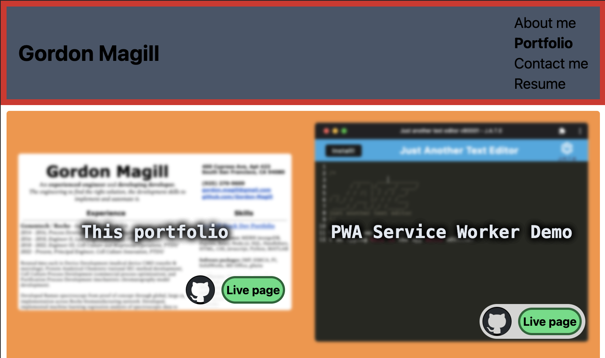

# React Portfolio

Deployed page: [LINK](https://gordon-magill.github.io/react-portfolio/)

## Description

A single page react application to showcase my portfolio of projects. Review a bio, check out my projects, send me a message, or simply look at my resume! Not much of a README here - go look at the portfolio already!

## Table of Contents

- [Questions](#questions)
- [License](#license)

## Questions

[Github: Gordon-Magill](https://github.com/Gordon-Magill) 
Email: gordon.magill@gmail.com
Please reach out via provided email for any questions.

## License

Licensed under [MIT](https://opensource.org/licenses/MIT).